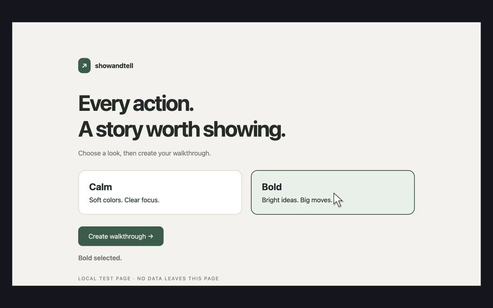

# showandtell

Turn Codex computer use into a local video, with an experimental Claude hook adapter. Capture each action's resulting screen, add a smooth animated cursor, and render an MP4 automatically in the background. No continuous screen recorder, recording server, account, or editor.

[Install](#install) · [Claude Code](#claude-code-experimental) · [Performance](#performance) · [Download v0.4.0](https://github.com/milind-soni/showandtell/releases/tag/v0.4.0)

[Watch the browser demo](demo/showandtell.mp4)



## Install

Requires current Codex desktop computer use and command hooks, **Python 3.10+**, and **FFmpeg**. Tested on macOS. Exporting saved captures also works on Linux; Windows capture is not supported.

**1. Install on your Mac:**

```sh
curl -fsSL https://raw.githubusercontent.com/milind-soni/showandtell/main/install.sh | sh
```

The installer checks Codex CLI, Python, and FFmpeg, uses your existing [Homebrew](https://brew.sh) for missing prerequisites, and installs this GitHub plugin. If everything is present, Homebrew is unnecessary. You can [inspect the installer](install.sh) first. It does not install Homebrew or grant hook trust.

**2. Review and enable Showandtell's hooks** in Codex (`/hooks` in the CLI). Installing a plugin does not grant hook trust. See [OpenAI's hook setup](https://learn.chatgpt.com/docs/hooks#review-and-trust-hooks).

**3. Start a new desktop chat and ask:**

> Use Showandtell to make a video of this walkthrough.

Once enabled, supported computer-use calls are recorded automatically in chats where the plugin is active. After each turn, a short-lived local job renders `~/.showandtell/<session>/<turn>/video.mp4`. It can finish after the chat process exits. Capture files stay on your computer until you delete them.

### Try it

> Use Showandtell to record a short walkthrough of https://github.com/milind-soni/showandtell. Browse the README, open Releases, and go back. Use coordinate clicks for smooth cursor animation. Verify that screenshots were saved, then give me the MP4.

Let the turn finish to queue automatic export. On your next message, ask **“Show me the latest Showandtell video from this chat.”** Default capture takes a screenshot after each supported action, including actions in a batch, so an intermediate state such as Calculator's cleared display can appear in the video.

### Claude Code (experimental)

Showandtell includes a Claude hook adapter for the **bundled local Codex computer-use MCP**, registered as `codex-cu`. The launch/configuration path is verified; native operation also depends on the engine accepting app approval. Install Claude Code first, then:

```sh
curl -fsSL https://raw.githubusercontent.com/milind-soni/showandtell/main/install.sh | sh -s -- --claude
```

This installs the Codex plugin, discovers the newest installed computer-use configuration, registers its command/arguments/environment with Claude, and adds Showandtell's hooks and skill. Existing unrelated settings are preserved, a changed settings file is backed up, and conflicting MCP configurations are refused. Repeating setup updates Showandtell's own installation. Tool permissions are not auto-approved.

Restart Claude Code and try:

> Use codex-cu to calculate 12 × 12 in Calculator in the background. Use normal screenshot observations and coordinate clicks. Showandtell should record it; give me the capture path.

If the native engine accepts the required app approval, a noninteractive run uses:

```sh
claude -p 'Use codex-cu to calculate 12 × 12 in Calculator in the background. Use screenshots and coordinate clicks so Showandtell records the walkthrough.' --allowedTools 'mcp__codex-cu__js'
sh ~/.showandtell/runtime/scripts/run.sh status
```

**Native capture still needs a running, logged-in Mac desktop, the installed app backend, and app consent accepted by that client.** In our headless Calculator test, the engine requested app approval and Claude declined it, so no native capture occurred. Try interactively in Claude and accept its normal app prompt if shown; this release does not auto-approve or guarantee consent persists into headless runs. Browser calls in the external-client test also failed because the engine required Codex `session_id`/`turn_id` metadata. Claude browser operation is therefore not verified or supported on that tested backend; use Codex for browser capture.

This is unofficial reuse of the bundled MCP, not a standalone public computer-use API. App updates can break it. Rerun setup to refresh the server configuration; manually edited or unrelated `codex-cu` registrations are left for you to review.

Claude captures are namespaced under `~/.showandtell/claude-<session>/<turn>/`. Its recorder runtime is copied into `~/.showandtell/runtime`, so pruning a versioned Codex plugin cache does not remove Claude's hook scripts. Claude's input-rewriting hook leaves its normal permission decision in place. See [Claude hooks](https://code.claude.com/docs/en/hooks) and [MCP setup](https://code.claude.com/docs/en/mcp).

To test without changing Claude user settings, from a clone:

```sh
sh plugins/showandtell/scripts/run.sh claude-setup --output /private/path/to/config
claude -p 'Use codex-cu to calculate 12 × 12 in Calculator with screenshot observations.' \
  --strict-mcp-config --mcp-config /private/path/to/config/mcp.json \
  --settings /private/path/to/config/settings.json --allowedTools 'mcp__codex-cu__js'
```

The generated files contain local runtime configuration and should stay private. This mode uses the clone's script paths, so keep the clone in place for that run.

### Manual installation

```sh
brew install --cask codex # if missing
brew install python ffmpeg # if missing
codex plugin marketplace add milind-soni/showandtell
codex plugin add showandtell@showandtell
```

For optional Claude setup from a clone:

```sh
sh plugins/showandtell/scripts/run.sh claude-setup --install
```

No Python or npm packages, Showandtell API key, or remote recording server are needed.

### Update or uninstall

Finish active recordings before updating, rerun the installer, review changed hooks, and start a **new chat**. For Claude, rerun with `--claude` and restart Claude Code. A GitHub-backed Codex installation can also update with:

```sh
codex plugin marketplace upgrade showandtell
codex plugin add showandtell@showandtell
```

Remove the Codex plugin with `codex plugin remove showandtell@showandtell`. For Claude, remove Showandtell's hook entries from `~/.claude/settings.json`, remove its skill directory `~/.claude/skills/showandtell`, and remove the server with `claude mcp remove --scope user codex-cu` if you no longer use it. Settings backups and captures are retained until you delete them. `SHOWANDTELL_DISABLED=1` in the environment launching the agent temporarily disables capture and automatic export.

### Troubleshooting

| Problem | What to do |
| --- | --- |
| Missing prerequisites | Install with [Homebrew](https://brew.sh), then rerun the installer. |
| Codex does not recognize `plugin` | Update Codex CLI; the installer needs plugin commands. |
| An existing local marketplace is named `showandtell` | Update that local source and reinstall with `codex plugin add showandtell@showandtell`. The public installer does not replace it. |
| No video | Check hook enablement, start a new chat, and use supported unified computer-use actions with working screenshots. Shell and API calls are outside capture. Optional reuse mode also needs normal screenshot observations. |
| Hook points to a missing old version | Start a new chat or restart the agent to load current hooks. |
| Claude cannot find the Mac runtime | Open/update Codex desktop with computer use installed, then rerun Claude setup. |
| Claude says an app was not approved | Try the native task interactively and review its normal app-approval prompt. Setup cannot grant that consent; headless execution is not guaranteed. |
| Claude browser call reports missing Codex turn metadata | Use Codex for browser capture. The tested bundled browser backend requires host metadata unavailable in that Claude run. |
| Export is queued or failed | Use `status`; inspect `export.json` and private `export.log`, then retry with `export <capture-directory>`. |
| Storage is unavailable | The computer-use runtime must permit local file writes. Report the storage failure instead of claiming a complete video. |

## What happens

1. `PreToolUse` adds the recorder to the supported JavaScript MCP call after its required first discovery call.
2. Default `actions` mode takes a screenshot after each supported public app/tab action returns. It also captures a baseline before the first action on a surface if no image of that surface has been saved in the current turn. Normal `getScreenshot` and `getAXStateAndScreenshot` observations are saved too. These screenshot calls and local writes are awaited during capture.
3. Post hooks collect the private sidecar files, including files from failed calls. Stop collects any remainder and starts a detached export job with disconnected input/output.
4. FFmpeg renders 1280×800 H.264 at 60 fps with eased cursor travel, click ripples, drag motion, and shortened idle pauses. Per-turn locking and capture digests avoid duplicate rendering; a successful export atomically replaces the previous video.

There is no continuously running Showandtell daemon. The capture and encoder use local CPU and disk. `status` returns without waiting for rendering and reports queued, rendering, ready, error, or no-frames. Saved captures can be exported again if the machine shuts down or an export fails.

**Codex hook permission behavior:** Codex requires `permissionDecision: "allow"` with `updatedInput` to rewrite a tool call. Showandtell uses this only for the exact CUA JavaScript tool name. Review that behavior before trusting the hook; it is not a passive observer. Claude supports input rewriting without this permission decision, so its adapter omits it. Showandtell does not install a PermissionRequest hook or edit approval settings. See [Codex hooks](https://learn.chatgpt.com/docs/hooks).

## Performance

**Default capture adds a screenshot call after every supported action**, plus an initial baseline when needed. This preserves intermediate results when several actions share one tool call. Screenshot calls and local writes are awaited; operating an app in the background does not make capture asynchronous or free. Hook processes and rewritten JavaScript also cost time and may affect context/token usage. Showandtell makes no extra LLM API requests itself. Only MP4 export runs as a separate background job, consuming local CPU and disk.

The video holds each saved image until the next screenshot. It captures results after an action returns, not continuous animation, a press-down state, or every stage of a later loading transition. An action without a preceding screenshot of its surface has no synthetic cursor. A turn without usable images reports no-frames instead of fabricating a video.

Set `SHOWANDTELL_CAPTURE` in the environment launching Codex or Claude, then start a fresh chat to change modes:

| Mode | Additional screenshots | Coverage |
| --- | --- | --- |
| `actions` (default) | One after each supported action, plus a baseline per surface/turn when needed | Captures intermediate action results even within a batch. |
| `reuse` | None | Copies only normal screenshot observations; states between observations can be missing. |
| `full` | One before and one after each supported action | Captures both sides of each action at additional capture cost. |

All modes save normal screenshot observations and use the same detached export. Reuse mode may produce no video when the agent only reads accessibility text.

Baseline component measurements from the earlier full-capture implementation, September 27, 2026, on an Apple M5 with 24 GiB RAM and macOS 26.3.1:

| Measurement | Result | Scope |
| --- | --- | --- |
| Native Blender screenshot | 416 ms median | Six calls, 379–471 ms; about 0.78 MB each. |
| Two extra screenshots per action | About 0.83 seconds | Historical full-mode estimate before hook/file costs, not a measurement of the new default. |
| Pre/post hook processes | About 65 ms each | Nine runs each; empty post collection; excludes host dispatcher. |
| Export a saved 13.35-second video | 1.72 seconds median | Three exports, 1.56–2.15 seconds; 1280×800 at 60 fps. |

These are component measurements of 0.2.0, **not an end-to-end benchmark or speed guarantee for 0.4.0**. App load, resolution, disk speed, and recording length change the result. Captures consume disk space until removed.

A fresh October 4 check on a heavily loaded Mac measured roughly 1.03 seconds per pre-hook and 1.58 seconds per empty post-hook before the final launcher adjustment; the system load average was about 150. Host scheduling can dominate overhead. The launcher now skips unrelated Python site startup hooks because the recorder needs only stdlib. This change does not establish a speed guarantee.

## Using it with GitHub

- Install/update directly from this repository; plugin directory approval is unnecessary for this route.
- Record browser walkthroughs of GitHub or demonstrate a local app for a PR using supported computer-use actions.
- Attach `video.mp4` to a GitHub issue or PR description; H.264 MP4 is a [supported attachment format](https://docs.github.com/en/get-started/writing-on-github/working-with-advanced-formatting/attaching-files), subject to upload limits.
- Render an already saved capture in GitHub Actions with Python and FFmpeg. Fresh capture needs the local computer-use runtime and desktop; this repository does not provide a hosted capture runner.

Git commands, `gh`, GitHub MCP/API calls, code edits, and GitHub Copilot actions are outside the capture path. Showandtell does not upload recordings automatically.

## Limits

- **Snapshots, not live footage.** Default capture saves the screen after each supported action returns. Page animation, scroll transitions, per-character typing, and other changes between screenshots are not preserved. Cursor movement is reconstructed, not the original ghost cursor's exact trajectory.
- Coordinate clicks/drags can animate when a preceding screenshot exists. Accessibility-index actions supply no public pointer coordinates, so no position is invented.
- Use public unified `cua` app/tab methods and mutable `let`/`var` handles. First discovery remains unchanged. Immutable handles may miss capture; reacquire a mutable handle if warned. Direct Playwright and older browser-only tools are not instrumented.
- Native screenshots may contain the engine's ghost cursor, so native videos can show duplicate cursors. Browser screenshots tested for the original demo were clean.
- Optional reuse mode can miss intermediate results within a batch. It cannot recover arbitrary internal screenshots, turn accessibility text into images, or recover truncated legacy image data.
- Local storage permissions are required. Storage failure produces a warning while the UI action remains usable; it does not weaken permissions.
- The optional Claude route depends on an unofficial bundled Mac MCP, app approval, and the app backend. Our headless native test stopped at app consent; the browser test stopped at missing Codex turn metadata. It is not a general remote/headless desktop service.

## Local tools

From a clone:

```sh
sh plugins/showandtell/scripts/run.sh doctor
sh plugins/showandtell/scripts/run.sh status
sh plugins/showandtell/scripts/run.sh status /path/to/capture
sh plugins/showandtell/scripts/run.sh export /path/to/capture
sh plugins/showandtell/scripts/run.sh render /path/to/capture
sh plugins/showandtell/scripts/run.sh import /path/to/rollout.jsonl -o /path/to/capture
```

`export` records status and errors; `render` is the direct renderer. `session.json` is the portable screenshot/action manifest. `export.json` stores current export status and warnings. `SHOWANDTELL_HOME` changes capture storage. Claude's installed launcher is `sh ~/.showandtell/runtime/scripts/run.sh`.

The legacy importer reads saved Codex CUA/browser MCP results without executing their code. It cannot recover missing frames or exact pointer paths.

Marker logs omit typed text, key values, URLs, and raw tool code. **Screenshots contain whatever is visible.** Review videos before sharing. [Data handling](PRIVACY.md) · [Support](https://github.com/milind-soni/showandtell/issues)

## Packaging and development

The plugin has a portable `plugin.json` plus the Codex compatibility manifest. OpenAI directory publication remains separate; see [SUBMISSION.md](SUBMISSION.md). Build the archive with:

```sh
python3 scripts/package.py
```

This creates `dist/showandtell-0.4.0.zip` and its SHA-256 checksum. The archive includes only plugin files, excluding captures and development material. Claude setup discovers the runtime already installed on your Mac; that runtime is not redistributed.

No Python or Node packages are required. Node is needed only for recorder checks:

```sh
python3 -m unittest discover -s tests -p 'test_*.py'
python3 tests/test_render.py
node --test tests/test_capture.mjs
```

For the disposable browser fixture, run `python3 -m http.server 8768 --bind 127.0.0.1 --directory demo`, then drive `http://127.0.0.1:8768` through computer use. Renderer checks produce a real MP4, verify it with FFprobe, and cover frame chronology, cursor endpoints, bounds, and atomic failure recovery. Hook checks cover Claude prompt/session boundaries, failed calls, preserved permissions, detached export, and concurrent status reads. Setup/installer checks use isolated command stubs and temporary homes.

Validation of the updated default action capture is in progress. The earlier Calculator smoke test verified 144 and detached MP4 export, but reuse mode missed an intermediate cleared display; the new default addresses that gap with a screenshot after each action. A fresh action-mode Calculator demo is pending. Real Claude headless runs reached the MCP and hook dispatcher, but native capture stopped at app approval and browser capture stopped at missing Codex host metadata. These limits are reported above.

For a local Codex installation: `codex plugin marketplace add /absolute/path/to/showandtell`, then `codex plugin add showandtell@showandtell`.
